

    <button class="tablinks active" onclick="openTab(event, 'Overview')">Overview</button>
   

**Create a New Repository to Collaborate with others**

Now that you know how to create a repository (or refresh your memories), we are going to learn how to connect with others.

In this section, you are to find at least two other people in the class and create a repository. One person will create the repository and then add the others as collaborators.

1. Find the green "New repository" button and press it.
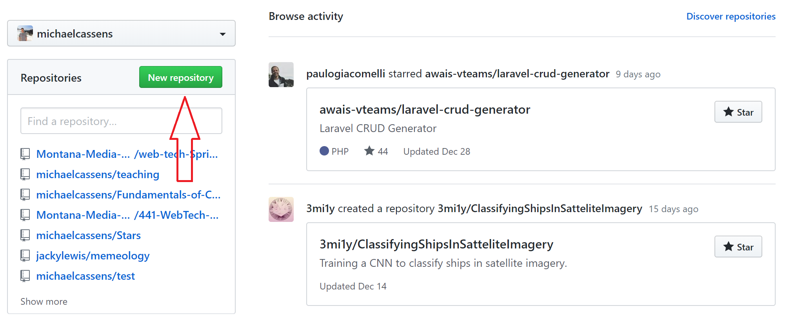
4. Give your repository a great name, like "_220-Collaboration_".
    - Optionally, give this repo a description, like "_This is how we share, Creative Coding 2 (MART220) course._".
5. Keep this as a "Public" repo.
6. Select the "Initialize this repository with a README" box.
7. Finally press the "Create Repository" button.

 

Your browser will now show you the brand new repository!

**Add Collaborators**

1. Now, go to the Settings and click on _Collaborators_

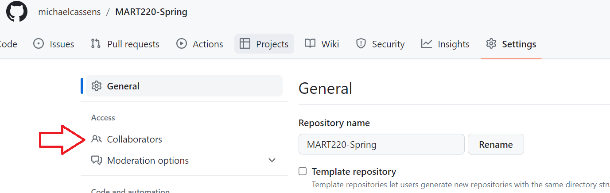

2. Click _Add People_and search for the collaborators by GitHub username or email.

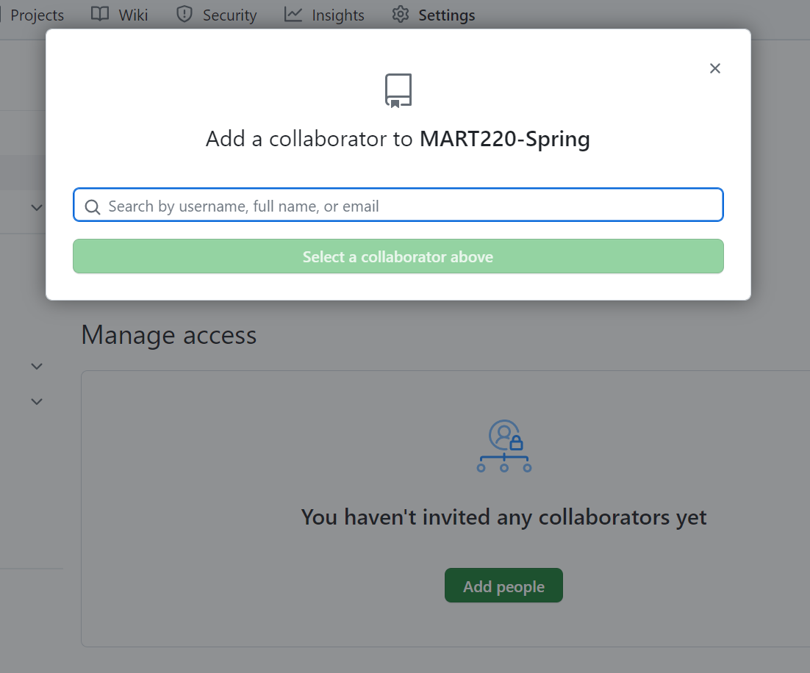

3. An email will be sent and the collaborator will need to accept.

**Pull from the repo and create content**

1. Just as before, the all collaborators can use GitHub Desktop or any other Git pull to get the respository.
2. However, instead of everyone pulling from main, each will create their own _branch_.

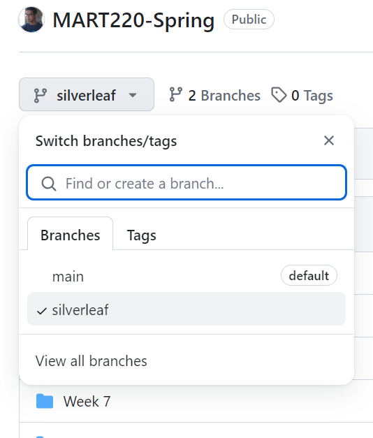

3. Now, each user can pull the code and it will in their branch.
4. Make sure you have chosen your branch in GitHub Desktop.

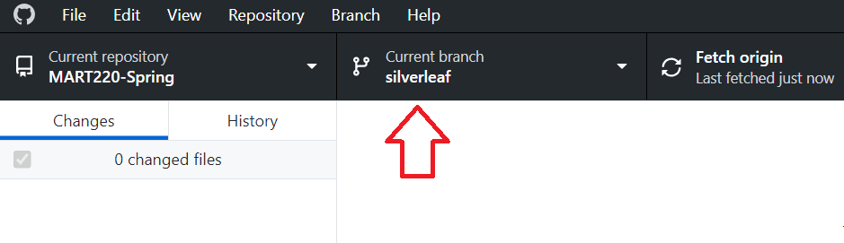

5. Next change the ReadMe.md file.  Add some text and push.

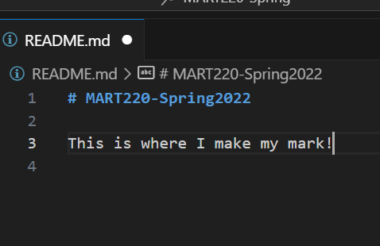

6. Next click Preview Pull Request

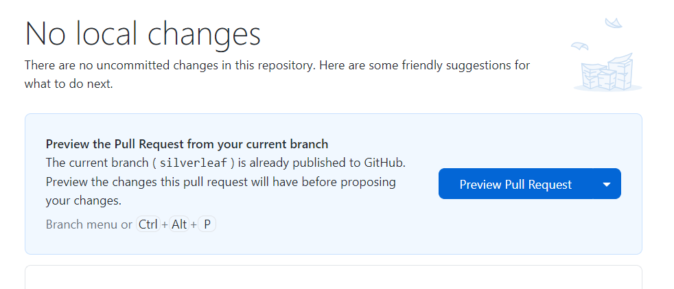

7. Make sure the main branch is where you are merging into and then click Create Pull Request.

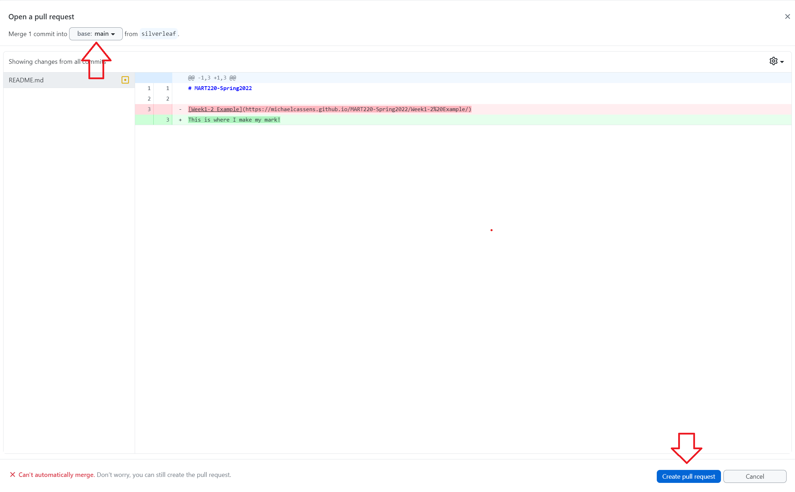

8. It should take you to GitHub.com and there you can click Create Pull Request.

9. Because of the changes, the conflicts will need to be resolved by clicking on resolve conflicts.

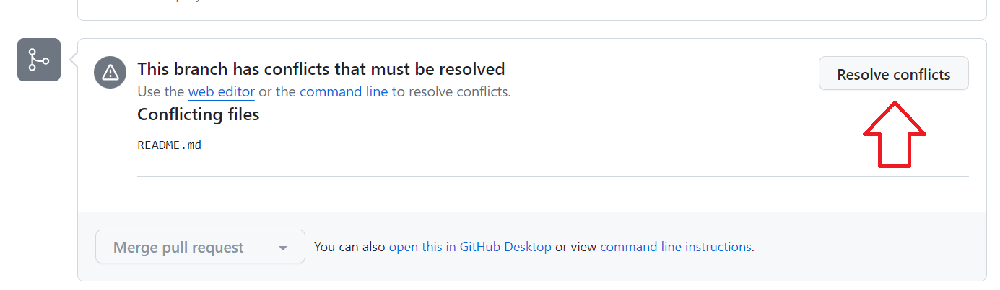

10. Remove all the conflicting markers.

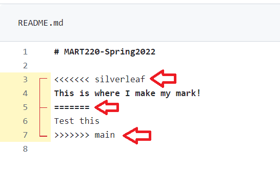

11. Then, click the Mark as resolved and then click Commit merge

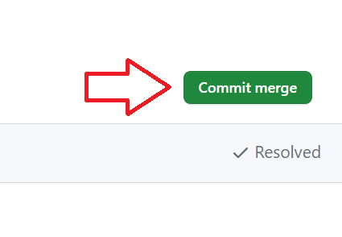

12.  Now all changes have been updated to main and remember to Pull Origin to make sure all branches are up to date.

